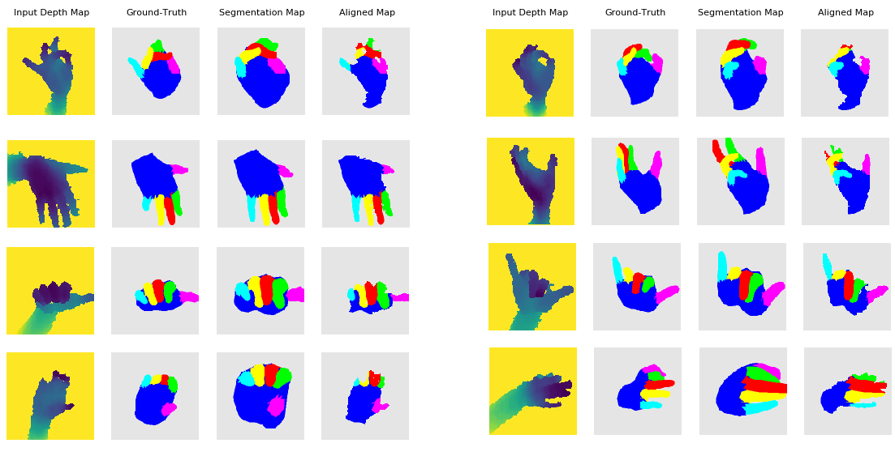

# **Weakly-supervised hand part segmentation from depth images**
This repository contains the code for method introduced in:  

[**Weakly-supervised hand part segmentation from depth images**](https://arxiv.org/)

# Qualitative Results
 

## Usage
1. Download the PyTorch implementation of the Mano model from [here](https://github.com/hassony2/manopth)
2. Replace the original manolayer.py with manolayer.py under the folder src (some changes made by us)
3. Run train.py

## Requirements
To run the code you can, e.g., install the following requirements:

 * python 3.
 * [PyTorch](http://pytorch.org/)
